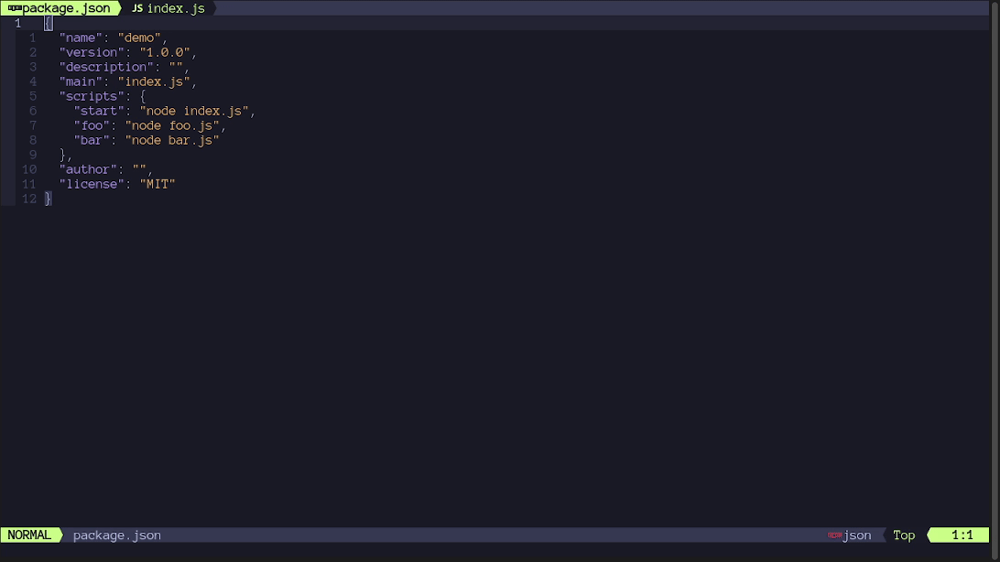

# runner.nvim

A customizable Neovim plugin to run code inside the editor

## Demo



## Table of Contents

- [Installation](#installation)
- [Usage](#usage)
- [Configuration](#configuration)
- [Handlers](#handlers)
- [Helpers](#helpers)
- [Advanced handlers configurations](#advanced-handlers-configurations)
- [Contribution](#contribution)

## Installation

  Using [packer.nvim](https://github.com/wbthomason/packer.nvim):

  ```lua
  return require('packer').startup(function(use)
    use {
      'MarcHamamji/runner.nvim',
      requires = {
        'nvim-telescope/telescope.nvim',
        requires = { 'nvim-lua/plenary.nvim' }
      },
      config = function()
        require('runner').setup()
      end
    }
  end)
  ```

  Using [lazy.nvim](https://github.com/folke/lazy.nvim):

  ```lua
  require('lazy').setup({
    {
      'MarcHamamji/runner.nvim',
      dependencies = {
        'nvim-telescope/telescope.nvim',
        dependencies = { 'nvim-lua/plenary.nvim' }
      }, 
      config = function()
        require('runner').setup()
      end
    }
  })
  ```

## Usage

### Commands

| Command           | lua                                | Description                              |
|-------------------|------------------------------------|------------------------------------------|
| `:Runner`         | `require('runner').run()`          | Runs code in buffer                      |
| `:AutoRunner`     | `require('runner').autorun()`      | Runs code in buffer on every file save   |
| `:AutoRunnerStop` | `require('runner').autorun_stop()` | Stops `AutoRunner` and closes the window |

### Lua

  ```lua
  require('runner').run()
  require('runner').autorun()
  require('runner').autorun_stop()

  -- Can also be called with the buffer number where the code is:
  -- require('runner').run( <buffer_number> )
  -- require('runner').autorun( <buffer_number> )

  -- To set a mapping
  vim.keymap.set('n', '<leader><space>', require('runner').run)
  ```

## Configuration

#### `setup(options)`

  Runner comes with the following defaults:

  ```lua
  require('runner').setup({
    position = 'right', -- position of the terminal window when using the shell_handler
                        -- can be: top, left, right, bottom
                        -- will be overwritten when using the telescope mapping to open horizontally or vertically
    width = 80,         -- width of window when position is left or right
    height = 10,        -- height of window when position is top or bottom
  })
  ```

## Handlers

  Runner has the concept of handlers. Handlers are language specific and are little
  functions that run code. For example, a handler could run the project, run the tests,
  build the project, or even run custom project scripts.

  A handler is a function that accepts a buffer number as an argument, and doesn't
  return anything. This buffer number is the buffer where the code to run is located.
  It defaults to the buffer where the `run()` function was called, or, if specified,
  is the buffer number that was passed to the `run()` function. Runner runs the
  appropriate handler based on this buffer's filetype.

  For using multiple handlers on the same filetype, see the [choice helper](#choicehandlers).
  
#### `set_handler(filetype, handler)`

  This function **overwrites** the handler set for the specified filetype. Default handlers can be found [here](./lua/runner/handlers/init.lua).

  | Argument name | Description | Type |
  |---------------- | --------------- | --------------- |
  | `filetype` | The filetype on which to run the given handler | `string` |
  | `handler` | The handler to run when the current file matches the filetype | `function(code_buffer_number)`  |

  Example:

  ```lua
  require('runner').set_handler('lua', function(code_buffer_number)
    vim.print('Running lua file in buffer ' .. code_buffer_number)
  end)
  ```

  **Note:** This method overwrites the default handlers set for the specified filetype.

## Helpers
  
  This plugin exposes some helpers to make creating handlers easier. They're all available by importing them as follows:

  ```lua
  local handler_name = require('runner.handlers.helpers').handler_name
  ```

  Here is a description of each one:

- #### `shell_handler(command, editable)`

    Runs a command in a shell by opening it in a new split window, with a terminal buffer.

    The split window's position will be determined by the `position` value from the config. It will be overwritten when using the telescope mapping to open horizontally or vertically.
  - `select_horizontal` (defaults to `<C-X>`): Opens the window at the bottom of the screen.
  - `select_vertical` (defaults to `<C-V>`): Opens the window at the right of the screen.
    <br/>
    <br/>

    | Argument name | Description | Type |
    |---------------- | --------------- | --------------- |
    | `command` | The shell command to run when the handler is called | `string` |
    | `editable`| Whether the user should be prompted to edit the command using `vim.input()` before running it. Useful when giving command line arguments to a script | `boolean` *(optional, defaults to false)* |

    Example:

    ```lua
    local shell_handler = require('runner.handlers.helpers').shell_handler
    require('runner').set_handler('rust', shell_handler('cargo run', true))
    ```

- #### `command_handler(command)`

    Runs a command in the Vim command mode.

    | Argument name | Description | Type |
    |---------------- | --------------- | --------------- |
    | `command` | The Vim command to run when the handler is called | `string` |

    Example:

    ```lua
    local command_handler = require('runner.handlers.helpers').command_handler
    require('runner').set_handler('lua', command_handler('luafile %'))
    ```

- #### `choice(handlers)`

    Opens a `Telescope` finder to allow the user to choose which handler to run.

    | Argument name | Description | Type |
    |---------------- | --------------- | --------------- |
    | `handlers` | The list of handlers to choose from | `table` where the keys are the name of the handlers in the `telescope` finder, and where the values are the actual handlers |

    Example:

    ```lua
    local choice = require('runner.handlers.helpers').choice
    require('runner').set_handler('rust', choice({
      ['Run'] = helpers.shell_handler('cargo run'),
      ['Test'] = helpers.shell_handler('cargo test'),
      ['Custom'] = helpers.shell_handler('cargo ', true),
    }))
    ```

## Advanced handlers configurations
  
  For creating dynamic handlers like one for each `npm` or `cargo` script, you can write your own handler function that generates the other handlers, gives them to the choice handler, and runs it itself.
  See [Node.js example](lua/runner/handlers/languages/nodejs/init.lua).

## Contribution

  This project uses [StyLua](https://github.com/JohnnyMorganz/StyLua) for enforcing code style, and has a [pre-commit](https://pre-commit.com/) hook setup for running it automatically. `runner.nvim` also has a Github Action that runs the linter on every Pull request. If a check doesn't pass on a specific Pull request, please lint the code and commit it again.

  For running them locally, you have to have them installed on your system:

- [StyLua Installation](https://github.com/JohnnyMorganz/StyLua#installation)
- [pre-commit Installation](https://pre-commit.com/#install)

#### Some useful commands

- Install the pre-commit hook

    ```bash
    pre-commit install
    ```

- Check for StyLua errors

    ```bash
    stylua --check lua/
    ```

- Fix StyLua errors

    ```bash
    stylua lua/
    ```
  
  Licensed under the [MIT license](./LICENSE).
